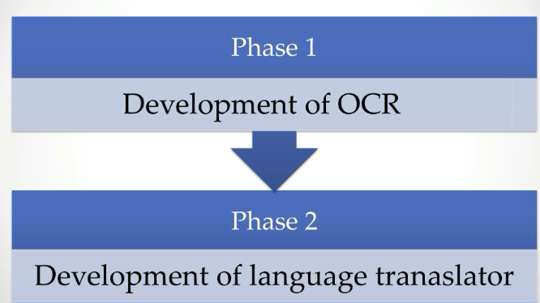

# Detect Text in Image and Translate it into Target Language.

## What are we making and buisness use-case ? 
We are making an Optical Character Recognition and Text Translation. 
- Optical Character Recoginition
    - It is one of the most important day eye concept. It is used in mutliple AI project such as traffic number plate detection system and handwritting recognition system.
- Text Translation
    - It is also one of the most important AI concept used in many application for translation of text to particular target language.
    

**Use Case**
We can use it to identify images on your camera and gain more information about landmarks, places, plants, animals, products, and other objects. It can also be used to scan and translate text.
    

## Project Goals and Objectives

1. Basics and quick theory of optical character recognition and translation engine.
2. Create our own optical character recognizer from scratch.
3. Different ways of building OCR.

After these three steps we will be able to recognize text from images . Now next step involves translation.

4. Here we convert the text into particular target language.

